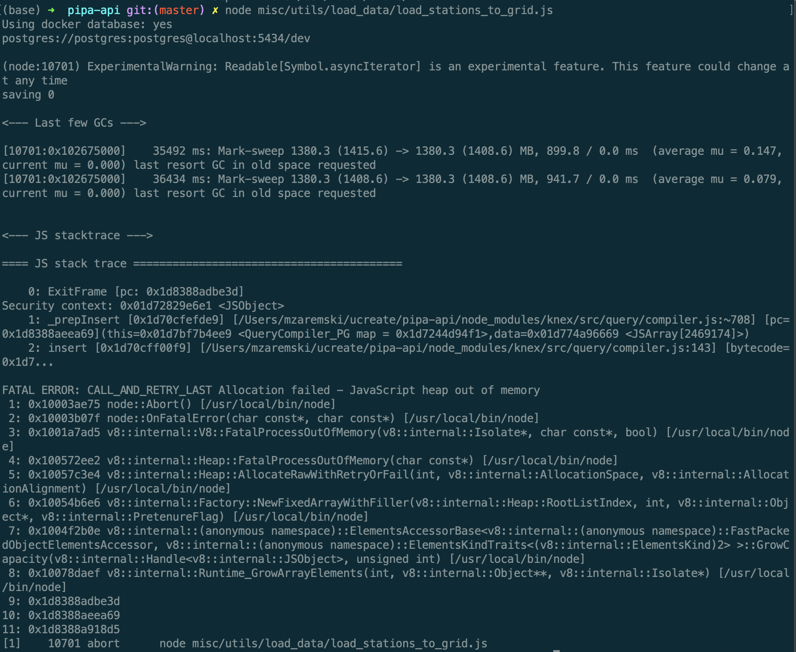
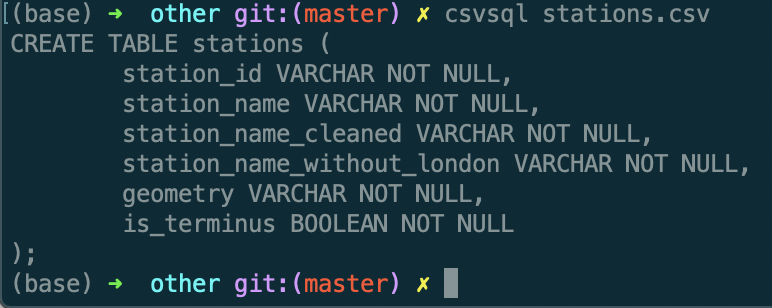

# Loading datasets to the Database
There are guidelines about loading datasets to the database.
I have written it because in PiPA we have noticed a few problems with it, and we wanted others to don't repeat them.
The main goal of this is that datasets should be loaded by seeds and store in the repository even when the files weighs a lot.

We have got data from R&D team to load it to our database to use it with our API. The files are `.csv` extension.
What comes to our mind is loading them to DB via tools like [postico](https://eggerapps.at/postico/) or [pgAdmin](https://www.pgadmin.org/).
We create migrations, run them and open postico to choose file to loa...

Wait. We must ask ourself a few questions:
1. Do I need to do it 3 times or more? (localhost, staging, production)
2. Do I want someone to do the same process at his localhost when he joins to the project?
3. What about really large files?
4. What if R&D changes dataset?
5. What about migrations?

Instead of loading data manually. We can, for example, use [knex seeds](https://knexjs.org/#Seeds) and store `.csv` files in repository.
It gives us possibility to get database ready (with complete data) with one command.
When we push them to staging/production or setup project on different device it load to db automatically.

There aren't any problems to store 50MB files in the repository. But GitHub recommends to avoid storing files larger than 50MB and doesn't allow us to store files larger than 100MB. [(source)](https://help.github.com/en/articles/working-with-large-files)
That's why it would be good reason to turn on [Git Large File Storage](https://git-lfs.github.com/).

When it comes to point 4.
When R&D team gives us updated dataset, we want to update a particular row and insert new one.
We use script that run `INSERT` or `UPDATE` if any constraint has been violated.
```
INSERT INTO [...] ON CONFLICT ON CONSTRAINT [...] DO UPDATE SET [...]
```

### How does script work?
Script uploads csv to temporary table in batches.
Thanks to this we know about loading progress and we don't get `heap out of memory` like here:

When it is finished, it migrates data to proper table and delete temporary one.
The example script is [here]('./load_csv_to_database').
And execution is [here]('./load_example.js').

### What about migrations?
Sometimes we have a lot of columns in csv, so rewriting everything is time consuming and boooring.
It is recommended to use [csvkit](https://csvkit.readthedocs.io/en/latest/index.html
)
`csvsql dataset_name.csv` - This command generates sql statement that creates table.
But before creating migration with it - make sure that there is proper data types.


#### So there is a full path:
1. We have task to load animals species into the api database
2. R&D team works on it and provides us with data as `animal_species.csv` file
3. Backend team creates a migration. Then we use csvkit that generates `CREATE TABLE` sql statement for us. We only check and correct it.
4. Run migration
5. Create seeds by `knex seed:make load_animal_species`.
6. In the seed we should execute `loadCSVToDatabase`. So there is an [example](./load_example)
7. Fill parameters. As second parameter we need to insert copied names of all columns from csvkit output. As 3rd parameter we need to rewrite column names with changed names if needed.
8. Run `npx knex seed:run`

Everyone is encouraged to contribute.
If you see some places for refactoring in the example code - open an issue and it will be dealt with.
If anyone has any questions, please open an issue for that or ping me on slack.

Useful tools:
- https://git-lfs.github.com/
- https://csvkit.readthedocs.io/en/latest/index.html

Useful links:
- https://infinum.co/the-capsized-eight/superfast-csv-imports-using-postgresqls-copy
- https://help.github.com/en/articles/working-with-large-files
- https://knexjs.org/#Seeds
